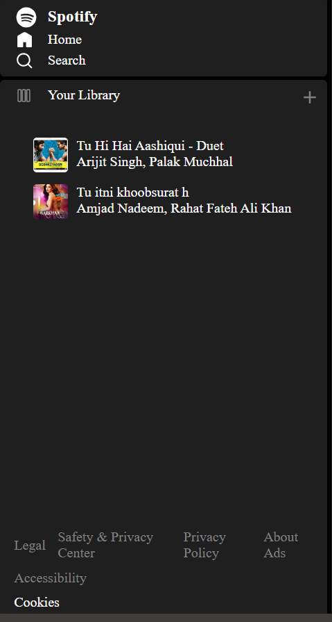
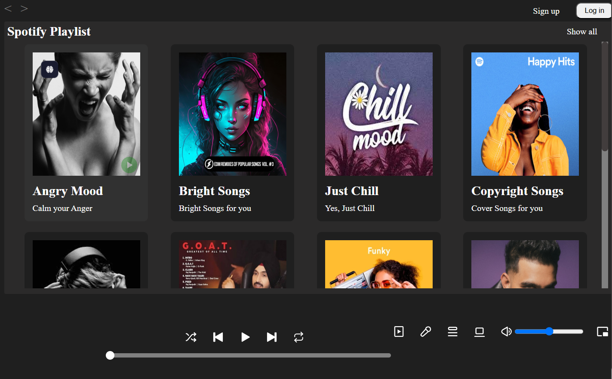

# 🎧 Spotify Clone

This is a frontend-only **Spotify Clone** built using **HTML**, **CSS**, and **JavaScript**. It mimics the core UI and functionality of Spotify's web player — from sleek visuals to basic music controls.

---

## 🚀 Features
- 🎵 Responsive design for desktop and mobile
- ⏯️ Play/Pause functionality
- 📊 Seek bar with real-time playback progress
- 🎧 Dynamic song list with album covers and titles
- 💡 Smooth transitions and hover effects

---

## 🔧 Tech Stack
- **HTML5** – For structure
- **CSS3** – For layout, animations, and responsiveness
- **JavaScript** – For interactivity and media control

---

## 📸 Screenshots

### 🎶 Liked Playlist View

### 📂 Playlist Page

---

